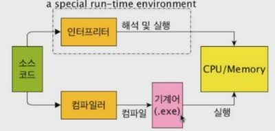

# 용어 및 개념정리 1.

## 1. 웹사이트 vs. 웹 애플리케이션 vs. 모바일 애플리케이션

 용어 | 개념 
:---: | ---
웹 사이트 | 웹 브라우저에 배포된 정적 문서로서 일방적으로 정보를 얻을 수 있는 페이지들의 모음.<br>요즘은 댓글 기능, 좋아요, 검색 기능을 통해 사용자로부터 데이터를 입력받을 수 있게 되어 웹 애플리케이션과의 경계가 무너짐.
웹<br> 애플리케이션 | 웹 브라우저(사용자의 OS 종류나 버전과 무관)와 웹 기술을 사용하여, 사용자와 상호작용(네트워크 통신)이 가능한 형태. 데이터 CRUD가 가능함.<br> ex) 댓글 기능, 검색 기능, 일정 수정 등
모바일<br>어플리케이션 | 스마트폰이나 태블릿과 같은 모바일 장치에서 사용하는 프로그램. <br><u>네이티브 앱</u> : 각 플랫폼에 맞는 프로그래밍 언어와 SDK로 개발<br> ex) ios앱은 swift,objective-C로, 안드로이드앱은 kotlin,java 으로 개발하는 것<br><u>모바일 웹</u> : 웹 기술로 개발되었지만, 모바일 브라우저에 의해 실행됨. 일반적인 웹 사이트의 느낌을 모바일에 그대로 옮긴 형태.<br><u>모바일 웹앱</u> : 모바일에 최적화된 형태. 웹 기술만 사용해서 풀 스크린모드, 애니메이션 효과, 터치 상호작용 등을 구현하여 모바일 환경에서 네이티브 앱과 유사한 실행환경과 사용자 경험을 제공함. 앱스토어에서는 판매 불가능.<br><u>하이브리드 앱</u> : 웹과 네이티브앱의 특징을 조합하여 만든 것으로 내부는 웹 기술로 구현되고, 외형은 네이티브 형태를 가짐. 앱스토어에서 판매 가능.

## 2. CRUD
컴퓨터 프로그램이 데이터베이스를 사용하기 위한 기초적인 4가지 쿼리 형식.
이름 | 의미 | SQL
:---: | :---: | :---:
Create | 생성 | INSERT
Read | 조회 | SELECT
Update | 수정 | UPDATE
Delete | 삭제 | DELETE

## 3. 자바스크립트(성장 과정)
처음엔 웹페이지의 단순한 보조 기능을 처리하기 위한 제한적인 용도(서버로부터 전달받은 HTML과 CSS 렌더링)로 설계됨, 현재는 애플리케이션 개발 언어로 성장 중.   
ps. 대부분의 프로그래밍 언어는 애플리케이션을 개발하기 위한 범용적인 용도
1. Ajax(Asynchronous Javascript And XML, 1999)   
자바스크립트를 이용해 서버와 브라우저가 **비동기** 방식으로 데이터를 교환할 수 있는 통신 기능.   
화면이 전환될 때, 변경할 필요가 없는 부분은 처음부터 다시 렌더링하지 않고, 서버로부터 필요한 데이터만 전송받아 변경해야 하는 부분만 한정적으로 렌더링하는 방식.   
그 결과, 웹 브라우저에서도 데스크톱 애플리케이션과 유사한 빠른 성능과 부드러운 화면 전환이 가능해짐. ex) 구글 맵스

1. jQuery(2006)    
HTML의 조작을 단순화 하도록 설계된 자바스크립트 라이브러리.   
 jQuery의 등장으로 DOM(Document Object Model)을 더욱 쉽게 제어할 수 있게 되었고, 크로스 브라우징 이슈도 어느 정도 해결됨.

1. V8 자바스크립트 엔진(5번 참고)

1. Node.js    
브라우저의 자바스크립트 엔진에서만 동작하던 자바스크립트를 브라우저 이외의 환경에서 동작할 수 있도록 독립시킨 자바스크립트 실행 환경.   
주로 서버 사이드 애플리케이션 개발에 사용되며, 이에 필요한 모듈, 파일 시스템, HTTP 등 내장 API 제공.   
비동기 I/O 지원, 단일 스레드 이벤트 루프 기반으로 동작하여 요청 처리 성능이 좋기 때문에 실시간으로 데이터를 처리하는 페이지에 적합. 

1. SPA 프레임워크   
애플리케이션을 위한 프로그래밍 언어로 성장하며 복잡해진 개발 과정을 도와주는 CBD(Component based development)방법론 기반의 프레임워크.    
ex) Angular, React, Vue.js, Svelte 등

## 4. ES(ECMAScript, 1997)
Ecma 인터내셔널에 의해 제정된 ECMA-262 기술 규격에 의해 정의된 하나의 사양을 의미. '표준 사양인 ECMA-262'와 동의어.    
스크립트 언어가 준수해야 하는 규칙, 세부 사항 및 지침을 제공함. (스크립트 언어는 이래야 해!)
- ECMA 인터내셔널 : 정보 통신에 대한 **표준을 제정**하는 비영리 표준화 기구.   
ex) 표준의 대상은 CD롬 볼륨과 파일 구조, C#언어 규격, JSON 포맷 등

- ECMA-262 : ECMA 인터내셔널에 의해 제정된 하나의 **기술 규격의 이름**으로, 범용 목적의 스크립트 언어에 대한 명세(값, 타입, 객체와 프로퍼티, 함수, 표준 빌트인 객체 등)를 담고 있음.  

- 스크립트 언어 : 독립된 시스템에서 작동하도록 특별히 설계된 프로그래밍 언어. 

- JavaScript(1996) : ECMAScript 사양을 준수하는 범용 스크립팅 언어.   
ECMAScript와 브라우저가 별도 지원하는 클라이언트 사이드 Web API(W3C 관리, DOM, BOM, Canvas, XMLHttpRequest, Fetch, requestAnimationFrame, SVG, Web Storage, Web Component, Web worker 등)를 아우르는 개념.

- ES6(ECMAScript 6) : 2015년도에 나온 ECMA-262 표준의 제 6판이며, ECMAScript 사양의 주요 변경 사항 및 개선 사항을 명세함. let/const키워드, 화살표 함수, 클래스, 모듈 등 범용 프로그래밍 언어로서 갖춰야 할 기능들이 등장.

- 바벨(Babel) : ES6 사양으로 작성된 코드를 함수적으로 동일한  ES5코드로 바꿔주는 기술(트랜스파일러). ES6의 사양을 준수하지 않는 IE를 위한 것..

- ps. 왜 ECMAScript(1997.07)는 JavaScript(1996.03) 뒤에 나온 것일까? : 마이크로소프트가 IE에 자바스크립트의 파생버전인 JScript를 탑재하면서부터.. 당시 90%이상의 점유율을 가진 넷스케이프 커뮤니케이션즈의 넷스케이프 내비게이터와 호환이 되지 않는 크로스브라우징 이슈가 발생함. 표준화된 자바스크립트의 필요성이 대두되며, 넷스케이프 커뮤니케이션즈가 ECMA 인터내셔널에 표준화를 요청하여 ECMAScript가 탄생하게 됨

## 5. JavaScript 엔진
- JavaScript 코드를 이해하고 실행하는 프로그램 또는 인터프리터를 의미. 웹 브라우저마다 수행 능력 차이가 있고, 지원되는 ECMAScript도 다름.   

- 브라우저가 JavaScript를 잘 지원한다면 ECMAScript 호환성이 좋다는 의미. 즉, 해당 브라우저의 JavaScript 엔진이 ECMAScript를 잘 준수하여 만들었다는 뜻!   

- 참고로, 자바스크립트는 인터프리터 언어이지만 인터프리터 언어의 단점인 느린 실행 속도를 높이기 위해 현대 자바스크립트 엔진 내부에서 실행 중 컴파일이 필요한 경우 내부(JIT 컴파일러, Just-In-Time)에서 컴파일 과정을 거친다.  

- 2008년, 빠른 성능을 보여주는 V8 자바스크립트 엔진의 등장으로 웹 애플리케이션 프로그래밍 언어로 정착. 브라우저 단에서 렌더링해주는 보조 역할에서 웹 서버에서 수행되던 로직들을 처리하게 됨.   
ex) Google Chrome - V8(2008), Mozilla Firefox - SpiderMonkey, Microsoft Edge - Chakra, 사파리 - JavaScriptCore   

## 6. 컴파일 언어 vs. 인터프리터 언어
용어 | 개념
:---: | ---
컴파일 언어 | c, c++ 등 고급언어로 쓰여진 소스 코드를 기계어(머신 코드)로 컴파일해서 실행파일을 만들어(컴파일 단계) 실행(실행 단계)하는 언어. 따라서, 실행결과를 바로 확인하면서 코딩 불가능.<br>실행 속도가 빠르지만 프로그램 수정시 컴파일을 거쳐야 하기 때문에 불편함.
인터프리터 언어 | 소스 코드를 컴파일 하지 않고 인터프리터로 한 줄씩 중간코드인 바이트코드(가상 머신에서 실행하도록 만든 바이너리 코드)로 변환해가며 바로 실행하는 언어. 따라서, 실행결과를 바로 확인하면서 코딩 가능.<br>실행 속도는 느리지만 프로그램 수정이 간단함.
<br>

  <br>`컴파일러와 인터프리터의 차이`

## 7. 크로스 플랫폼(멀티 플랫폼)
- 여러 종류의 컴퓨터 플랫폼에서 동작이 가능하다는 의미.    
- 자바스크립트의 경우, 웹, 모바일 하이브리드 앱, 서버 사이드, 데스크톱, 머신러닝, 로보틱스 환경에서 동작 가능.

## 8. 런타임
- 코드가 실행되는 단계.   
- 자바스크립트의 경우, 런타임에 컴파일되며 실행 파일이 생성되지 않음

## 9. 파싱
- 구문 분석.   
- 프로그래밍 언어의 문법에 맞게 작성된 텍스트 문서를 읽고 문법적으로 더이상 나눌 수 없을 때까지 분해한 후, 문법적인 의미와 구조를 반영하여 트리 구조의 자료구조인 파스트리를 생성하는 일련의 과정. 브라우저의 렌더링 과정에서 더 깊게 공부!

## 10. 인코딩 vs. 디코딩
- 인코딩 : <u>문자</u>를 어떻게 <u>숫자</u>로 바꾸는지 정의.
- 디코딩 : <u>숫자</u>를 어떻게 <u>문자</u>로 바꾸는지 정의.

## 11. 아스키코드(American Standard Code for information interchange)
- 숫자와 문자를 매칭시키는 국제적인 규칙.(1비트+8비트)
- 1바이트(2^8=256), 즉 8비트의 데이터를 사용함.
- ex) 100 0001(2) == 65(10) == 'A'
- 패리트 비트(데이터의 에러를 탐지하기 위함)를 제외하고 2^7인 128개의 문자 표현 가능.
- 알파벳 대소문자 52개, 숫자 10개, 특수 문자 32개, 널 문자 1개, 그 외 제어 문자 32개로 구성.
- 문제점 : 영어만 표현 가능

## 12. 유니코드(Universal Code System)
- 전 세계 언어의 문자를 정의하기 위한 국제 표준 코드.
- 2바이트(2^16=65,536)를 사용.
- 고어, 토속어 같은 모든 문자를 담기 위해 약 백만자가 넘는 문자를 추가로 정의함.
- 문제점 : 영어를 표현할 땐 1바이트, 한글을 표현할 땐 2바이트, 다른 특수문자를 표현할 땐 3바이트로 표현되어 컴퓨터에게 혼란을 줌.
- 따라서, 어떤 글자는 1바이트, 어떤 글자는 2바이트로 읽을지 정해주기 위해 다양한 인코딩 방식 존재. ex) UCS-2, UCS-4, UTF-7, UTF-8, UTF-16, UTF-32

## 13. UTF-8(가변길이 인코딩 방식)
- 문자열 집합과 인코딩 형태를 8비트(1바이트) 단위로 한다는 의미.
- 한 문자를 나타내기 위해 1바이트~6바이트까지 사용하는 가변 길이 인코딩 방식을 사용. 대부분 (메모리 낭비를 줄이기 위해)
- 아스키코드로 표현 가능한 것들은 1바이트로 표현하고, 안되면 2바이트 이상을 사용함.
- 보통 일반적인 문자는 3바이트 내로 처리되며, 4바이트 영역에는 이모지 같은 문자가 있음
- 고대 문자 같은 것을 사용하지 않는 한 5바이트 이상을 쓰는 경우는 없음.
- 아스키 코드와 호환 가능.
- JSON은 UTF-8 인코딩만 사용하며, 다른 문자열 인코딩은 지원하지 않음.
- 윈도우, 자바, 임베디드를 제외한 거의 모든 환경에서의 문자열 처리 표준.
- 0xxxxxxxx : 첫번째 바이트가 0으로 시작한다면 0이외의 7비트를 아스키로 인식.
- 110xxxxx 10xxxxxx : 두번째 바이트까지 읽어서 하나의 문자로 표현
- 1110xxxx 10xxxxxx 10xxxxxx : 세번째 바이트까지 읽어서 하나의 문자로 표현
- 11110xxx 10xxxxxx 10xxxxxx 10xxxxxx : 네번째 바이트까지 읽어서 하나의 문자로 표현

## 14. UTF-16(가변길이 인코딩 방식)
- 문자열 집합과 인코딩 형태를 16비트(2바이트) 단위로 한다는 의미.
- 2바이트 또는 4바이트 길이의 문자열 사용.
- 자바와 윈도우환경과 호횐됨.
- 아스키 코드와 호환되지 않음.

## 15. UTF-32(가변길이 인코딩 방식)
- 4바이트를 고정적으로 사용.
- 반드시 UTF-32를 사용해야하는 환경이 아니라면 사용하지 않음.

## 16. ECU-KR
- 한국어 문자 집합으로 문자 하나를 표현하기 위해 사용.
- 2바이트를 사용함.
- 아스키 코드 문자를 표현할 때 1바이트를 사용하기 때문에 아스키 코드와 호환 가능.
- 영문자 'Hello'를 출력할 때는 아스키 코드와 동일하게 1바이트씩 총 5바이트 사용.
- 한글 '안녕하세요'를 출력하기 위해서는 2바이트씩 총 10바이트 사용.

## 17. 왜 1바이트는 8비트일까?
- 컴퓨터 아키텍쳐는 영문권에서 발전.
- 문자를 표현하기 위해 7~8비트가 충분했기 때문(feat.아스키코드)

## 18. 메모리
- 비트 : 데이터의 단위. 1바이트 = 8비트.    
 컴퓨터가 데이터를 전송할 때, 한번에 전송할 수 있는 양을 나타냄. ex)32비트 컴퓨터는 한번에 32비트(4바이트)를 전송할 수 있고, 64비트 컴퓨터는 한번에 64비트(8바이트)를 전송할 수 있음.
 - 8비트 컴퓨터는 메모리에 256개의 주소를 가리킬 수 있고, 32비트 컴퓨터는 약 43억개(4GB = 4 * 1,024 * 1,024 * 1,024)의 주소를 가리킬 수 있고, 64비트 컴퓨터는 8GB(엄청 많음)의 주소를 가리킬 수 있다. 그러므로, 32비트 컴퓨터에서는 4GB이상으로 메모리를 추가해도 사용할 수 없음. 

## 19. CPU

## 20. 키워드(명령문)
- 자바스크립트 코드를 해석하고 실행하는 자바스크립트 엔진이 수행할 동작을 규정한 일종의 명령.
- 자바스크립트 엔진은 키워드를 만나면 자신이 수행해야 할 약속된 동작을 수행함.
- ex) var키워드를 만나면 자바스크립트 엔진은 뒤에 오는 변수 이름으로 새로운 변수를 선언함.

## 21. 변수
- 하나의 값을 저장하기 위해 확보한 메모리의 공간 자체 또는 그 메모리 공간을 가리키는 이름.
- 숫자, 문자, 객체, 함수 등을 담을 수 있음.
- 여러 개의 값을 저장하려면 객체나 배열 같은 자료구조를 사용하여 그룹화해서 하나의 값처럼 사용하는 방법이 있음.

## 22. 변수 선언, 변수 선언문
- 변수 선언 : 변수를 생성하는 것. 변수를 사용하려면 반드시 선언해야 함. 선언하지 않은 식별자에 접근하면 참조 에러 발생!   
값을 저장하기 위한 메모리 공간을 확보하고 변수 이름과 확보된 메모리 공간의 주소를 연결해서 값을 저장할 수 있게 준비하는 것.
  1. 선언 단계 : 변수 이름을 등록해서 엔진에 변수의 존재를 알림. 
  2. 초기화 단계 : 값을 할당하지 않았을 때는, 엔진에 의해 암묵적으로 `undefined`라는 값이 할당되어 초기화 됨.
- 변수 선언문 : `var 변수 이름;`  `let 변수 이름;` `const 변수 이름;` 

## 23. var, let, const
- var :
- let :
- const : 단 한번만 할당할 수 있는 변수를 선언할 때 쓰는 키워드. 상수를 표현할 수 있음.

## 24. 쓰레기값, 초기화
- 쓰레기값 : 확보된 메모리 공간에 이전에 다른 애플리케이션이 사용했던 값이 남아있는 것
- 초기화 : 변수가 선언된 이후 최초로 값을 할당하는 것. 값을 지우는 것이 아닌 쓰레기값에 덮어 씌우는 것.

## 25. 가비지 콜렉터
- 애플리케이션이 할당한 메모리 공간을 주기적으로 검사하여 더 이상 사용되고 있지 않는 메모리(어떤 식별자와도 연결되어 있지 않음, 참조하지 않음)를 해제하는 기능.

## 26. 언매니지드 언어 vs. 매니지드 언어
용어 | 개념
--- | ---
언매니지드 언어 | C 등의 언어는 개발자가 명시적으로 메모리를 할당하고 해제할 수 있음.<br>개발자가 주도적으로 메모리 제어가 가능.<br>개발자의 역량에 따라 최적의 성능을 확보할 수 있지만 반대의 경우 치명적인 오류 발생.
매니지드 언어 | 자바스크립트 등의 언어는 개발자가 직접적으로 메모리 제어가 불가능.<br>가비지 콜렉터만이 메모리 제어가 가능.

## 27. 식별자
- 메모리 상에 존재하는 어떤 값을 구별해서 식별할 수 있는 고유한 이름. 
- 어떤 값이 메모리 공간에 저장되어 있을 때, 식별자는 값이 저장되어 있는 메모리 주소를 기억하고 있음. 동시에 메모리 주소와 매핑 관계를 맺으며, 이 매핑 정보도 메모리에 저장됨.
- 메모리 주소를 기억하고 있기 때문에 메모리 주소에 붙인 이름이라고 할 수 있음.
- 변수, 함수, 클래스 등의 이름 ==> 모두 식별자

## 28. 네이밍 컨벤션
- 식별자는 특수문자를 제외한 문자, 숫자, _. $ 포함 가능
- 식별자는 숫자로 시작할 수 없음
- 예약어는 식별자로 사용할 수 없음
- 변수, 함수 이름 : 카멜 케이스(firstName)
- 생성자 함수, 클래스 이름 : 파스칼 케이스(FirstName)

## 29. 호이스팅
- 변수 선언문보다 변수를 참조하는 코드가 선행되었을 때, 변수 선언문이 코드의 선두로 끌어 올려진 것처럼 동작하여 참조 에러를 발생시키지 않는 것.
```javascript
console.log(score); // undefined

var score; // 변수 선언문 먼저 실행
```
- 엔진이 가급적 에러를 안내기 위해 소스 코드를 한줄씩 순차적으로 실행(런타임) 전 단계인 준비단계(**소스코드의 평과 과정**)에서 모든 선언문(변수 선언문, 함수 선언문 등)을 먼저 실행시킴. 그 후, 소스 코드가 한줄씩 순차적으로 실행됨.
- 변수 선언이 소스 코드의 어디에 있든 찾아내서 다른 코드보다 먼저 실행함
- var, let, const, function, function*, class 키워드를 사용해서 선언하는 모든 식별자는 호이스팅 됨.

## 30. 할당, 변수 할당문, 바인딩, 참조
- 할당 : 변수에 값을 저장하는 것.
- 변수 할당문 : `var 변수 이름 = 값;`   
하나의 문으로 단축 표현이 가능하지만 엔진은 변수 선언(런타임 이전), 값 할당(런타임) 두개의 문으로 나누어 실행함. 
```javascript
console.log(score); // undefined

var score; // 1. 변수 선언
score = 100; // 2. 값 할당
// var score = 100; // 2개의 문으로 나눠서 실행
// 이 때, 100은 undefined를 덮어씌우는게 아닌 새로운 메모리 공간을 확보하고 그 곳에 할당한 값을 저장함.

console.log(score); // 100
```
- 바인딩 : 변수 이름과 메모리 공간의 주소를 연결하는 것.
- 참조 : 변수에 저장된 값을 읽어 들이는 것.

## 31. 동적 타입 언어 vs. 정적 타입 언어

## 32. IPO Model

## 33. console
- 로딩된 웹페이지의 에러를 확인하거나 자바스크립트 소스코드에 작성한 console.log 메서드의 실행 결과 확인하는 곳.

## 34. DOM
<br>

## # Reference
1. https://nitro04.blogspot.com/2020/01/web-web-application-web-site.html
1. https://blog.naver.com/web4click/110156074762
1. https://wormwlrm.github.io/2018/10/03/What-is-the-difference-between-javascript-and-ecmascript.html
1. https://velog.io/@awesomelon/%EC%9C%A0%EB%8B%88%EC%BD%94%EB%93%9CUTF-8-UTF-16-UTF-32


